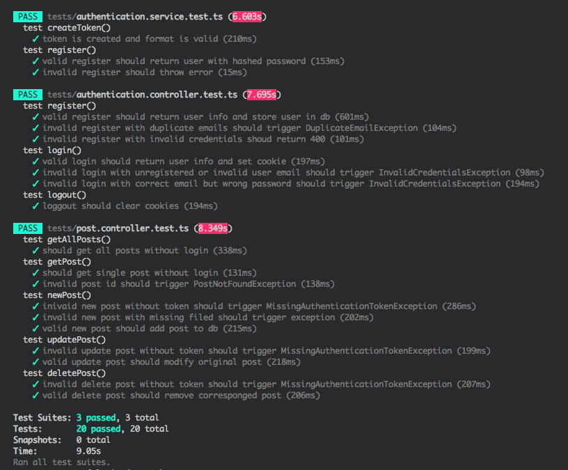

# Express Restful

使用 typescript + express + mongodb 构建的 restful api 服务器, 包含测试用例

## 项目截图

测试用例如下:


## 项目结构
```bash
├── src/                                  # 源代码目录
  ├── app.ts                              # 应用入口
  ├── authentication                      # auth service
  ├── controllers                         # 控制器
  ├── dto                                 # 客户端发送的数据接口
  ├── exceptions                          # 异常
  ├── interfaces                          # 接口
  ├── middleware                          # 自定义中间件
  ├── models                              # orm 模型
  ├── operations                          # 数据操作 service
  ├── server.ts                           # 入口文件
  └── utils                               # 工具
├── tests/                                # 测试目录
  ├── authentication.controller.test.ts   
  ├── authentication.service.test.ts
  ├── dbHandler.ts
  └── post.controller.test.ts
├── jest.config.js
├── package.json
└── tsconfig.json
```

## 项目运行与测试

**运行**:

运行前需要修改 .env 下的环境变量

```bash
$ git clone https://github.com/hacker0limbo/express-restful.git
$ cd express-restful
$ npm install
$ npm run dev
```

**测试**:
```bash
$ npm run test
```

## API 接口

```bash
/auth:  
  POST /auth/login            # 登录, 成功返回包含 token 的 cookie, 失败返回异常
  POST /auth/register         # 注册, 成功返回对应用户信息, 失败返回异常
  POST /auth/logout           # 登出, 删除客户端包含的含有 token 的 cookie

/posts:
  GET /posts                  # 返回所有 posts, 不需要权限
  GET /posts/:id              # 返回对应 id 的 post, 不需要权限
  POST /posts                 # 增加一个 post, 需要登录权限
  PUT /posts/:id              # 更新一个 post, 需要登录权限
  DELETE /posts/:id           # 删除一个 post, 需要登录权限

/report/user:
  GET /report/user:           # 所有用户的信息


Exceptions 异常:
  DuplicateEmailException     # 注册出现重复 email 抛出
  ExpiredAuthenticationToken  # token 过期抛出
  HttpException               # 异常基类
  InvalidAuthenticationToken  # 客户端提供的错误 token 抛出
  InvalidCredentialsException # 登录密码出错抛出
  MissingAuthenticationToken  # 未提供 token 抛出
  PostNotFoundException       # 访问不存在的 post 抛出
```

## 参考
- https://wanago.io/courses/typescript-express-tutorial/